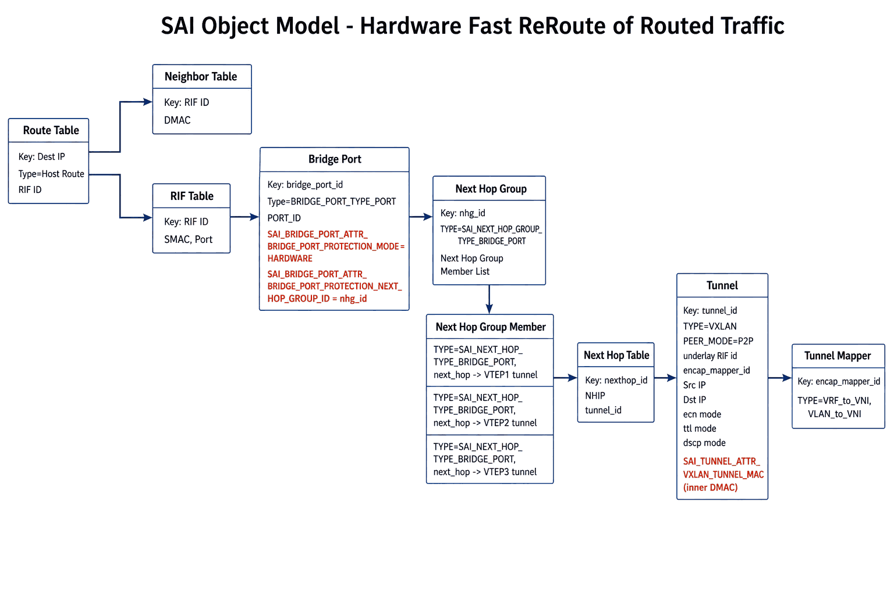
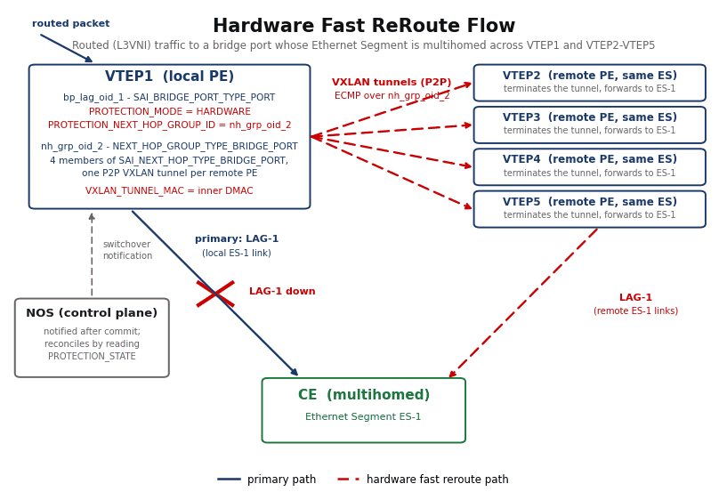

#  EVPN VxLAN Multihoming
-------------------------------------------------------------------------------
 Title       | SAI support for EVPN VxLAN Multihoming
-------------|-----------------------------------------------------------------
 Authors     | Jai Kumar, Rajesh Sankaran, Broadcom Inc.<br>Manas Kumar Mandal, Cisco Inc.
 Status      | In review
 Type        | Standards track
 SAI-Version | 1.16
-------------------------------------------------------------------------------

# Table of Contents

- [List of Tables](#List-of-Tables)
- [Revision](#Revision)
- [1.0 Introduction](#10-introduction)
  - [1.1 Acronyms](#11-acronyms)
- [2.0 EVPN MH Requirements](#20-evpn-mh-sai-requirements)
- [3.0 EVPN MH SAI Components](#30-evpn-mh-sai-components)
  - [3.1 New SAI objects](#31-new-sai-objects)
  - [3.2 Changes to existing SAI objects](#32-changes-to-existing-sai-objects)
- [4.0 Sample Workflows](#40-sample-workflow)
  - [4.1 Known unicast MAC workflow](#41-known-unicast-workflow)
  - [4.2 Split horizon workflow](#42-split-horizon-workflow)
  - [4.3 DF Workflow](#43-df-workflow)
  - [4.4 Fast failover workflow](#44-fast-failover-workflow)
  - [4.5 Single Active Redundancy workflow](#45-single-active-redundancy-workflow)
  - [4.6 Hardware fast reroute workflow](#46-hardware-fast-reroute-workflow)


# Revision

| Rev  | Date       | Authors                                          | Change Description |
| ---- | ---------  | ------------------------------------------------ | ------------------ |
| 0.1  | Sep 23' 2024   | Jai Kumar, Rajesh Sankaran                   | Initial draft  |
| 0.2  | Oct 23' 2024   | Rajesh Sankaran                              | Changed DF, single active attributes |
| 0.3  | Aug 14' 2026   | Manas Kumar Mandal                           | Added hardware-based fast reroute (protection mode, protection state, switchover notification) for L3VNI routed traffic to a cross-switch multihomed bridge port |


# 1.0  Introduction

This document describes the SAI changes required for supporting EVPN Multihoming based on [RFC 7432](https://datatracker.ietf.org/doc/html/rfc7432) and [RFC 8365](https://datatracker.ietf.org/doc/html/rfc8365).

RFC 7432 describes EVPN-MH support for MPLS networks and RFC 8365 describes the support for overlay networks like VxLAN.
The scope of this document is EVPN MH support for VxLAN networks.
 
## 1.1 Acronyms

| Acronym   | Description      |
|:----------|:----------|
| BUM      | Broadcast, Unknown unicast, Multicast     |
| DF       | Designated Forwarder                      |
| ES       | Ethernet Segment                          |
| EVPN     | Ethernet Virtual Private Network          |
| MH       | Multihoming                               |
| VNI      | Virtual Network Identifier                |
| VTEP     | VXLAN Tunnel End point                    |


# 2.0 EVPN-MH SAI Requirements

1. It shall be possible to create/delete a group of remote VTEPs.
2. It shall be possible to add/remove a remote VTEP to the remote VTEP group.
3. It shall be possible to create MAC addresses with the destination as the remote VTEP group. 
4. It shall be possible to set the MAC address destination as a remote VTEP group.
5. It shall be possible to implement the DF functionality at a per port basis. 
6. It shall be possible to implement the split horizon functionality as described in RFC 7432.
8. It shall be possible to implement single active redundancy mode as described in RFC 7432.
7. It shall be possible to implement a fast failover in the event of an ES going down.
9. It shall be possible for the hardware to autonomously reroute traffic - including L3VNI routed traffic whose next hop resolves to a locally attached, cross-switch multihomed ES/bridge port - to an ECMP group of remote VTEPs upon primary path failure, without waiting on control plane intervention, and to notify the control plane once the switchover has been committed in hardware.

# 3.0 EVPN-MH SAI Components

## 3.1 New SAI Objects 
No new SAI objects are introduced as part of this design.

## 3.2 Changes to Existing SAI Objects

### 3.2.1 Remote VTEP group support

A new nexthop group type to allow for MACs to point to the remote VTEP group is added.

```
typedef enum _sai_next_hop_group_type_t
...
    /** Next hop group is for bridge port */
    SAI_NEXT_HOP_GROUP_TYPE_BRIDGE_PORT,

} sai_next_hop_group_type_t;
```

A new nexthop type which will be part of groups of the above group type.

```
typedef enum _sai_next_hop_type_t
...
    /** Next hop group is for bridge port */
    SAI_NEXT_HOP_TYPE_BRIDGE_PORT,
} sai_next_hop_type_t;
```

The above nexthop type will need ATTR_TUNNEL_ID as well as ATTR_IP as mandatory parameters on creation.

```
typedef enum _sai_next_hop_attr_t
...
    /**
     * @brief Next hop entry IPv4 address
     *
     * @type sai_ip_address_t
     * @flags MANDATORY_ON_CREATE | CREATE_ONLY
     * @condition SAI_NEXT_HOP_ATTR_TYPE == SAI_NEXT_HOP_TYPE_IP or SAI_NEXT_HOP_ATTR_TYPE == SAI_NEXT_HOP_TYPE_MPLS or SAI_NEXT_HOP_ATTR_TYPE == SAI_NEXT_HOP_TYPE_TUNNEL_ENCAP or SAI_NEXT_HOP_ATTR_TYPE == SAI_NEXT_HOP_TYPE_BRIDGE_PORT
     */
    SAI_NEXT_HOP_ATTR_IP,


    /**
     * @brief Next hop entry tunnel-id
     *
     * @type sai_object_id_t
     * @flags MANDATORY_ON_CREATE | CREATE_ONLY
     * @objects SAI_OBJECT_TYPE_TUNNEL
     * @condition SAI_NEXT_HOP_ATTR_TYPE == SAI_NEXT_HOP_TYPE_TUNNEL_ENCAP or SAI_NEXT_HOP_ATTR_TYPE == SAI_NEXT_HOP_TYPE_SRV6_SIDLIST or SAI_NEXT_HOP_ATTR_TYPE == SAI_NEXT_HOP_TYPE_BRIDGE_PORT
     */
    SAI_NEXT_HOP_ATTR_TUNNEL_ID,
...
```

New Bridge-port of type next-hop group is introduced for FDB entries to point to the group of remote VTEPs.

```
typedef enum _sai_bridge_port_type_t
...
    /** Bridge nexthop group port */

    /** Nexthop group should be of type bridge port */
    SAI_BRIDGE_PORT_TYPE_BRIDGE_PORT_NEXT_HOP_GROUP,
} sai_bridge_port_type_t;
```

The Bridge-port of type next-hop group should have next-hop group ID attribute set.
```
typedef enum _sai_bridge_port_attr_t
{
...
    /**
     * @brief Associated nexthop group id
     *
     * @type sai_object_id_t
     * @flags MANDATORY_ON_CREATE | CREATE_ONLY
     * @objects SAI_OBJECT_TYPE_NEXT_HOP_GROUP
     * @condition SAI_BRIDGE_PORT_ATTR_TYPE == SAI_BRIDGE_PORT_TYPE_BRIDGE_PORT_NEXT_HOP_GROUP
     */
    SAI_BRIDGE_PORT_ATTR_BRIDGE_PORT_NEXT_HOP_GROUP_ID,
...
}
```

### 3.2.2 Designated Forwarder support

A new bridgeport attribute defined to drop BUM traffic egressing the bridgeport. The default value of this 
will be false. 
Note: Traffic dropped due to this should not be counted against SAI_PORT_STAT_IF_OUT_DISCARDS i.e Interface Tx drop counters.

```
typedef enum _sai_bridge_port_attr_t
{
...

    /**
     * @brief Indicates if the bridge port is set to drop the Tunnel Terminated broadcast, unknown unicast and multicast traffic
     * When set to true, egress BUM traffic will be dropped
     *
     * @type bool
     * @flags CREATE_AND_SET
     * @default false
     * @validonly SAI_BRIDGE_PORT_ATTR_TYPE == SAI_BRIDGE_PORT_TYPE_PORT or SAI_BRIDGE_PORT_ATTR_TYPE == SAI_BRIDGE_PORT_TYPE_SUB_PORT or SAI_BRIDGE_PORT_ATTR_TYPE == SAI_BRIDGE_PORT_TYPE_TUNNEL
     */
    SAI_BRIDGE_PORT_ATTR_TUNNEL_TERM_BUM_TX_DROP,
```

To handle DF election per VLAN and when a dot1q bridge model is used the above attribute is defined as part of the Vlan Member. 
 
```
typedef enum _sai_vlan_member_attr_t
{
...

    /**
     * @brief Indicates if the bridge port is set to drop the Tunnel terminated broadcast, unknown unicast and multicast traffic
     * When set to true, egress BUM traffic will be dropped
     *  
     * Valid only when the SAI_VLAN_MEMBER_ATTR_BRIDGE_PORT_ID is of type SAI_BRIDGE_PORT_TYPE_PORT.
     * 
     * @type bool
     * @flags CREATE_AND_SET
     * @default false
     * 
     */
    SAI_VLAN_MEMBER_ATTR_TUNNEL_TERM_BUM_TX_DROP,

```

### 3.2.3 Split Horizon support

  - Tunnels of peer mode SAI_TUNNEL_PEER_MODE_P2P are only considered here. 
  - The isolation group object of type SAI_ISOLATION_GROUP_TYPE_BRIDGE_PORT is used to achieve the split horizon functionality.
  - There is no change to the Isolation group and group member definition.
  - Bridgeport of type SAI_BRIDGE_PORT_TYPE_TUNNEL will have the isolation group attribute set.
  - The isolation group members will be the client side bridge ports of type SAI_BRIDGE_PORT_TYPE_PORT which share the ESI with the peering VTEPs.

### 3.2.4 Fast Failover support

A new Bridge port attribute (for type SAI_BRIDGE_PORT_TYPE_PORT) is introduced to specify the protection nexthop group ID.
When the Bridge port is down, all of the traffic to the Bridge port is redirected to the protection nexthop group.

```
typedef enum _sai_bridge_port_attr_t
{
...
    /**
     * @brief Associated protection bridge port nexthop group id
     *
     * The Protection nexthop group type should be SAI_NEXT_HOP_GROUP_TYPE_BRIDGE_PORT
     *
     * @type sai_object_id_t
     * @flags CREATE_AND_SET
     * @objects SAI_OBJECT_TYPE_NEXT_HOP_GROUP
     * @allownull true
     * @default SAI_NULL_OBJECT_ID
     */
    SAI_BRIDGE_PORT_ATTR_BRIDGE_PORT_PROTECTION_NEXT_HOP_GROUP_ID,

    /**
     * @brief Trigger a switch-over from primary to backup next hop
     *
     * @type bool
     * @flags CREATE_AND_SET
     * @default false
     * @validonly SAI_BRIDGE_PORT_ATTR_TYPE == SAI_BRIDGE_PORT_TYPE_PORT
     */
    SAI_BRIDGE_PORT_ATTR_BRIDGE_PORT_SET_SWITCHOVER
...
}
```

`SAI_BRIDGE_PORT_ATTR_BRIDGE_PORT_SET_SWITCHOVER` is deprecated by
`SAI_BRIDGE_PORT_ATTR_BRIDGE_PORT_PROTECTION_ADMIN_MODE` in 3.2.6, which expresses the same request and can also
hold the traffic on the bridge port. It remains supported for existing implementations.

### 3.2.5 Single Active Redundancy Mode support

Single Active redundancy mode requires unicast and BUM traffic to be dropped in the ingress and egress directions
on the client port.

The following 4 parameters should be set to true to achieve the traffic drop.

```
typedef enum _sai_bridge_port_attr_t
{
...

    /**
     * @brief Indicates if the bridge port is set to drop the ingress traffic
     * When set to true, all ingress traffic will be dropped
     *
     * @type bool
     * @flags CREATE_AND_SET
     * @default false
     * @validonly SAI_BRIDGE_PORT_ATTR_TYPE == SAI_BRIDGE_PORT_TYPE_PORT or SAI_BRIDGE_PORT_ATTR_TYPE == SAI_BRIDGE_PORT_TYPE_SUB_PORT or SAI_BRIDGE_PORT_ATTR_TYPE == SAI_BRIDGE_PORT_TYPE_TUNNEL
     */
    SAI_BRIDGE_PORT_ATTR_RX_DROP,

    /**
     * @brief Indicates if the bridge port is set to drop the egress traffic
     * When set to true, all egress traffic will be dropped
     *
     * @type bool
     * @flags CREATE_AND_SET
     * @default false
     * @validonly SAI_BRIDGE_PORT_ATTR_TYPE == SAI_BRIDGE_PORT_TYPE_PORT or SAI_BRIDGE_PORT_ATTR_TYPE == SAI_BRIDGE_PORT_TYPE_SUB_PORT or SAI_BRIDGE_PORT_ATTR_TYPE == SAI_BRIDGE_PORT_TYPE_TUNNEL
     */
    SAI_BRIDGE_PORT_ATTR_TX_DROP,
...
}
```

To handle Single Active redundancy PE per VLAN and when a dot1q bridge model is used the above attribute is defined as part of the Vlan Member. 
 
```
typedef enum _sai_vlan_member_attr_t
{
...

   /**
     * @brief Indicates if all ingress traffic for this vlan member will be dropped.
     * When set to true, ingress traffic will be dropped
     *  
     * Valid only when the SAI_VLAN_MEMBER_ATTR_BRIDGE_PORT_ID is of type SAI_BRIDGE_PORT_TYPE_PORT.
     * 
     * @type bool
     * @flags CREATE_AND_SET
     * @default false
     * 
     */
    SAI_VLAN_MEMBER_ATTR_RX_DROP,

   /**
     * @brief Indicates if all egress traffic for this vlan member will be dropped.
     * When set to true, egress unicast traffic will be dropped
     *  
     * Valid only when the SAI_VLAN_MEMBER_ATTR_BRIDGE_PORT_ID is of type SAI_BRIDGE_PORT_TYPE_PORT.
     * 
     * @type bool
     * @flags CREATE_AND_SET
     * @default false
     * 
     */
    SAI_VLAN_MEMBER_ATTR_TX_DROP,

```

### 3.2.6 Hardware Fast ReRoute (FRR) support

Section 3.2.4 describes a control-plane-driven ("software") switchover: the NOS detects that an Ethernet Segment (ES)
went down and explicitly requests, through `SAI_BRIDGE_PORT_ATTR_BRIDGE_PORT_SET_SWITCHOVER`, that traffic be
redirected to the protection next hop group.

This is extended here to cover the case where a packet is *routed* (e.g. an L3VNI/symmetric-IRB lookup) to a host
reachable over a bridge port that represents an ES which is multihomed across switches (i.e. the same ES/LAG is
also present on one or more remote PEs). When the local ES/bridge port goes down, the hardware itself - without
waiting for control-plane intervention - reroutes the routed traffic to a next hop group of remote VTEPs (an ECMP
group of VXLAN tunnels towards the other PEs of the ES), the same protection next hop group already introduced in
3.2.4. The NOS is notified asynchronously once the switchover has been committed, so it can reconcile control-plane
state (e.g. re-advertise/withdraw EVPN routes) after the fact instead of driving the switchover itself.


__Figure 1: SAI Object Model - Hardware Fast ReRoute of Routed Traffic__

The route lookup resolves to a RIF/neighbor pair, which in turn resolves to the primary bridge port (`SAI_BRIDGE_PORT_TYPE_PORT`)
for the ES. That bridge port carries `SAI_BRIDGE_PORT_ATTR_BRIDGE_PORT_PROTECTION_MODE` and
`SAI_BRIDGE_PORT_ATTR_BRIDGE_PORT_PROTECTION_NEXT_HOP_GROUP_ID`, pointing to a `SAI_NEXT_HOP_GROUP_TYPE_BRIDGE_PORT`
next hop group whose members (one per remote PE of the ES) are `SAI_NEXT_HOP_TYPE_BRIDGE_PORT` next hops resolving
through VXLAN tunnels. On primary path failure, hardware redirects the already-resolved route/neighbor traffic to
this next hop group without a new route lookup.

The route/neighbor DMAC resolved for the (now down) primary bridge port does not apply once traffic is redirected to
a remote-VTEP tunnel. A new tunnel attribute supplies the inner destination MAC to use for routed traffic
encapsulated by a P2P VXLAN tunnel, defaulting to the switch-wide VXLAN router MAC. It follows the same split SAI
already applies to the tunnel destination IP: a P2P tunnel terminates on exactly one remote PE, so the value belongs
on the tunnel alongside `SAI_TUNNEL_ATTR_ENCAP_DST_IP`, whereas a P2MP tunnel is shared by multiple next hops that
each carry their own destination in `SAI_NEXT_HOP_ATTR_IP` and their own inner destination MAC in
`SAI_NEXT_HOP_ATTR_TUNNEL_MAC`. The two attributes are therefore complementary, selected by
`SAI_TUNNEL_ATTR_PEER_MODE`, rather than two overlapping ways to set the same field. The tunnels used here are P2P,
one per remote PE of the ES, so the tunnel attribute applies.

```
typedef enum _sai_tunnel_attr_t
{
...
    /**
     * @brief VXLAN tunnel MAC
     *
     * Inner destination MAC used for routed packets encapsulated by this
     * P2P VXLAN tunnel.
     *
     * @type sai_mac_t
     * @flags CREATE_AND_SET
     * @default attrvalue SAI_SWITCH_ATTR_VXLAN_DEFAULT_ROUTER_MAC
     * @validonly SAI_TUNNEL_ATTR_TYPE == SAI_TUNNEL_TYPE_VXLAN and SAI_TUNNEL_ATTR_PEER_MODE == SAI_TUNNEL_PEER_MODE_P2P
     */
    SAI_TUNNEL_ATTR_VXLAN_TUNNEL_MAC,
...
}
```

A new attribute controls whether the switchover for a bridge port is driven by software (existing behavior, default)
or autonomously by hardware. Recovery behavior is set separately, through its own attributes, so the mode says only
which side picks the path and does not need a value for every combination.

In hardware mode the switchover starts when the adapter decides the bridge port can no longer forward traffic. This
is the qualified failure, and the switchover time is measured from it. Link event debounce and damping controls,
such as `SAI_PORT_ATTR_LINK_UP_DEBOUNCE_TIMEOUT` or damping applied above the adapter, only delay the link status
reported to the NOS; they do not delay the hardware. If either is configured on a member port of the ES, hardware
can move the traffic to the protection path before the NOS sees the bridge port go down.

```
typedef enum _sai_bridge_port_protection_mode_t
{
    /** Software switchover. Control plane determines the switchover behavior */
    SAI_BRIDGE_PORT_PROTECTION_MODE_SOFTWARE,

    /** Hardware switchover. Hardware selects the path autonomously */
    SAI_BRIDGE_PORT_PROTECTION_MODE_HARDWARE,

} sai_bridge_port_protection_mode_t;

typedef enum _sai_bridge_port_attr_t
{
...
    /**
     * @brief Protection switchover mode
     *
     * Applies only when SAI_BRIDGE_PORT_ATTR_BRIDGE_PORT_PROTECTION_NEXT_HOP_GROUP_ID
     * is set; otherwise the value is ignored.
     *
     * @type sai_bridge_port_protection_mode_t
     * @flags CREATE_AND_SET
     * @default SAI_BRIDGE_PORT_PROTECTION_MODE_SOFTWARE
     * @validonly SAI_BRIDGE_PORT_ATTR_TYPE == SAI_BRIDGE_PORT_TYPE_PORT
     */
    SAI_BRIDGE_PORT_ATTR_BRIDGE_PORT_PROTECTION_MODE,

    /**
     * @brief Revert to the bridge port once it recovers
     *
     * @type bool
     * @flags CREATE_AND_SET
     * @default true
     * @validonly SAI_BRIDGE_PORT_ATTR_BRIDGE_PORT_PROTECTION_MODE == SAI_BRIDGE_PORT_PROTECTION_MODE_HARDWARE
     */
    SAI_BRIDGE_PORT_ATTR_BRIDGE_PORT_PROTECTION_REVERTIVE,

    /**
     * @brief Wait to restore time in milliseconds
     *
     * @type sai_uint32_t
     * @flags CREATE_AND_SET
     * @default 0
     * @validonly SAI_BRIDGE_PORT_ATTR_BRIDGE_PORT_PROTECTION_REVERTIVE == true
     */
    SAI_BRIDGE_PORT_ATTR_BRIDGE_PORT_PROTECTION_WAIT_TO_RESTORE_TIME,
...
}
```

The companion proposal `doc/SAI-Proposal-HW-FRR.md` signals hardware-managed protection differently, by giving the
backup group the type `SAI_NEXT_HOP_GROUP_TYPE_HW_PROTECTION` within an enclosing
`SAI_NEXT_HOP_GROUP_TYPE_PROTECTION` group. That works there because both the primary and the backup are next hop
groups, so the pair has a containing object whose type can carry the hint. In the case described here the primary
path is the bridge port itself rather than a next hop group member, and the bridge port is the only object that sees
both sides of the pair, so the policy is expressed as an attribute on it. The type slot of the protection group is
in any case unavailable: it must be `SAI_NEXT_HOP_GROUP_TYPE_BRIDGE_PORT` (3.2.1) in order to hold
`SAI_NEXT_HOP_TYPE_BRIDGE_PORT` members, and the two values are mutually exclusive in the same enum. An attribute is
also the better operational fit, since `SAI_NEXT_HOP_GROUP_ATTR_TYPE` is `CREATE_ONLY` - a type-based hint could not
be moved between software and hardware control at run time - and a single type value could not carry the recovery
policy attributes without a separate group type per combination.

A read-only attribute reports which path (primary bridge port or protection next hop group) is currently committed
in hardware, under either protection mode. A third value covers the bridge ports for which protection is not
configured or not applicable, so that a NOS reconciling after a missed notification can tell an unconfigured bridge
port from one that is healthy on its primary path:

```
typedef enum _sai_bridge_port_protection_state_t
{
    /** Primary path is committed in hardware */
    SAI_BRIDGE_PORT_PROTECTION_STATE_PRIMARY,

    /** Protection path is committed in hardware */
    SAI_BRIDGE_PORT_PROTECTION_STATE_PROTECTION,

    /** Protection is not configured or not applicable for this bridge port */
    SAI_BRIDGE_PORT_PROTECTION_STATE_NOT_APPLICABLE,

} sai_bridge_port_protection_state_t;

typedef enum _sai_bridge_port_attr_t
{
...
    /**
     * @brief Protection switchover state
     *
     * Path currently committed in hardware. Returns
     * SAI_BRIDGE_PORT_PROTECTION_STATE_NOT_APPLICABLE when the bridge port type
     * is not SAI_BRIDGE_PORT_TYPE_PORT, or when no protection next hop group is
     * associated.
     *
     * @type sai_bridge_port_protection_state_t
     * @flags READ_ONLY
     */
    SAI_BRIDGE_PORT_ATTR_BRIDGE_PORT_PROTECTION_STATE,
...
}
```

The path also has to be pinnable administratively, for maintenance and for operator-driven traffic placement, and
the hardware selection must not override that intent. A boolean cannot express it, because it has no value meaning
"no override in effect" and therefore cannot distinguish holding the traffic on the bridge port from leaving the
choice to hardware. An administrative mode attribute carries the three states explicitly and supersedes the
existing `SAI_BRIDGE_PORT_ATTR_BRIDGE_PORT_SET_SWITCHOVER`, which is marked deprecated rather than removed since it
is already released. For compatibility, setting the deprecated attribute to true is equivalent to forcing the
traffic onto the protection next hop group, and setting it to false is equivalent to returning to automatic
selection.

```
typedef enum _sai_bridge_port_protection_admin_mode_t
{
    /** No administrative override. Path is selected per the protection mode */
    SAI_BRIDGE_PORT_PROTECTION_ADMIN_MODE_AUTO,

    /** Force the traffic onto the bridge port. Protection is locked out */
    SAI_BRIDGE_PORT_PROTECTION_ADMIN_MODE_PRIMARY,

    /** Force the traffic onto the protection next hop group */
    SAI_BRIDGE_PORT_PROTECTION_ADMIN_MODE_PROTECTION,

} sai_bridge_port_protection_admin_mode_t;

typedef enum _sai_bridge_port_attr_t
{
...
    /**
     * @brief Administrative override of the protection path
     *
     * @type sai_bridge_port_protection_admin_mode_t
     * @flags CREATE_AND_SET
     * @default SAI_BRIDGE_PORT_PROTECTION_ADMIN_MODE_AUTO
     * @validonly SAI_BRIDGE_PORT_ATTR_TYPE == SAI_BRIDGE_PORT_TYPE_PORT
     */
    SAI_BRIDGE_PORT_ATTR_BRIDGE_PORT_PROTECTION_ADMIN_MODE,
...
}
```

While an override is in effect the committed path does not follow bridge port failure or recovery and no switchover
notification is raised, so operator intent is not silently undone by hardware. The outcome is reported
synchronously in the return status of `set_bridge_port_attribute()`, and requesting
`SAI_BRIDGE_PORT_PROTECTION_ADMIN_MODE_PROTECTION` when no protection next hop group is associated returns
`SAI_STATUS_INVALID_PARAMETER`. Returning to `SAI_BRIDGE_PORT_PROTECTION_ADMIN_MODE_AUTO` releases the override and
selection resumes from the committed path.
This also supplies the recovery step for the non-revertive case: with
`SAI_BRIDGE_PORT_ATTR_BRIDGE_PORT_PROTECTION_REVERTIVE` set to false, the NOS forces the bridge port once it is
healthy again and then returns to automatic, which moves the traffic back and arms the hardware selection for the
next failure.

Support is discovered through the standard SAI capability queries, so no new switch attribute is required.
`sai_query_attribute_enum_values_capability()` on `SAI_BRIDGE_PORT_ATTR_BRIDGE_PORT_PROTECTION_MODE` returns the
modes the ASIC implements, and the NOS configures hardware switchover only when
`SAI_BRIDGE_PORT_PROTECTION_MODE_HARDWARE` is among them; the same call on
`SAI_BRIDGE_PORT_ATTR_BRIDGE_PORT_PROTECTION_ADMIN_MODE` reports which administrative overrides are available. For
the remaining attributes `sai_query_attribute_capability()` reports whether they are implemented, and an adapter
that cannot keep the traffic on the protection path after the bridge port recovers fails a set of
`SAI_BRIDGE_PORT_ATTR_BRIDGE_PORT_PROTECTION_REVERTIVE` to false with `SAI_STATUS_NOT_SUPPORTED`.

Finally, a notification callback informs the NOS whenever hardware commits a switchover, so that the control plane
can reconcile its state instead of having to poll `SAI_BRIDGE_PORT_ATTR_BRIDGE_PORT_PROTECTION_STATE`. A
notification is emitted after the data plane selection is committed; a
`SAI_BRIDGE_PORT_PROTECTION_EVENT_SWITCHOVER_FAILED` notification reports the unchanged
authoritative `current_state`. Notifications are advisory - `SAI_BRIDGE_PORT_ATTR_BRIDGE_PORT_PROTECTION_STATE`
remains the source of truth. A hardware-origin timestamp is left out for now, pending SAI defining a clock contract.

Notifications cover hardware-initiated transitions only. A path the NOS selects administratively, as described
below, reports its outcome synchronously in the return status of `set_bridge_port_attribute()`, and the resulting
path is readable immediately from `SAI_BRIDGE_PORT_ATTR_BRIDGE_PORT_PROTECTION_STATE`, so no asynchronous event is
needed for that case.

```
typedef enum _sai_bridge_port_protection_event_t
{
    /** Primary path failed */
    SAI_BRIDGE_PORT_PROTECTION_EVENT_PRIMARY_FAILURE,

    /** Primary path recovered */
    SAI_BRIDGE_PORT_PROTECTION_EVENT_PRIMARY_RECOVERY,

    /** Switchover attempt failed. Committed state is unchanged */
    SAI_BRIDGE_PORT_PROTECTION_EVENT_SWITCHOVER_FAILED,

} sai_bridge_port_protection_event_t;

typedef struct _sai_bridge_port_hw_protection_switchover_notification_data_t
{
    /** @objects SAI_OBJECT_TYPE_BRIDGE_PORT */
    sai_object_id_t bridge_port_id;

    /** Protection state before the switchover */
    sai_bridge_port_protection_state_t previous_state;

    /** Protection state after the switchover */
    sai_bridge_port_protection_state_t current_state;

    /** Reason for the switchover */
    sai_bridge_port_protection_event_t reason;

} sai_bridge_port_hw_protection_switchover_notification_data_t;

typedef void (*sai_bridge_port_hw_protection_switchover_notification_fn)(
        _In_ uint32_t count,
        _In_ const sai_bridge_port_hw_protection_switchover_notification_data_t *events);
```

The callback is registered as a switch attribute, mirroring the existing next hop group HW protection notification
(`SAI_SWITCH_ATTR_NEXT_HOP_GROUP_HW_PROTECTION_SWITCHOVER_NOTIFY`):

```
typedef enum _sai_switch_attr_t
{
...
    /**
     * @brief Bridge port HW protection switchover notification callback function passed to the adapter.
     *
     * @type sai_pointer_t sai_bridge_port_hw_protection_switchover_notification_fn
     * @flags CREATE_AND_SET
     * @default NULL
     */
    SAI_SWITCH_ATTR_BRIDGE_PORT_HW_PROTECTION_SWITCHOVER_NOTIFY,
...
}
```

# 4.0 Sample Workflow

This section describes the SAI object usage for different EVPN MH scenarios.


## 4.1 Known Unicast workflow


__Figure 2: Known Unicast Packet Flow__

At VTEP5 the following objects are created.

  - tnl_oid_1-tnl_oid_4 of type SAI_OBJECT_TYPE_TUNNEL corresponding to tunnels created to VTEP1-VTEP4.

```
    sai_attribute_t attr;
    std::vector<sai_attribute_t> tunnel_attrs;

    attr.id = SAI_TUNNEL_ATTR_TYPE;
    attr.value.s32 = SAI_TUNNEL_TYPE_VXLAN;
    tunnel_attrs.push_back(attr);

    attr.id = SAI_TUNNEL_ATTR_PEER_MODE;
    attr.value.s32 = SAI_TUNNEL_PEER_MODE_P2P;
    tunnel_attrs.push_back(attr);

    attr.id = SAI_TUNNEL_ATTR_ENCAP_DST_IP;
    attr.value.ipaddr = vtep1_ip; 
    tunnel_attrs.push_back(attr);

    sai_status_t status = sai_tunnel_api->create_tunnel(
                                &tnl_oid_1,
                                gSwitchId,
                                static_cast<uint32_t>(tunnel_attrs.size()),
                                tunnel_attrs.data()
                          );

    /* create_tunnel for vtep2_ip to vtep4_ip */
    ..................
    ..................

```
  
  - nh_oid_1 to nh_oid_4 of type SAI_OBJECT_TYPE_NEXT_HOP corresponding to tunnels (tnl_oid_1-tnl_oid_4)

```
    std::vector<sai_attribute_t> next_hop_attrs;
    sai_attribute_t next_hop_attr;

    next_hop_attr.id = SAI_NEXT_HOP_ATTR_TYPE;
    next_hop_attr.value.s32 = SAI_NEXT_HOP_TYPE_BRIDGE_PORT;
    next_hop_attrs.push_back(next_hop_attr);

    next_hop_attr.id = SAI_NEXT_HOP_ATTR_IP;
    next_hop_attr.value.ipaddr = vtep1_ip;
    next_hop_attrs.push_back(next_hop_attr);

    next_hop_attr.id = SAI_NEXT_HOP_ATTR_TUNNEL_ID;
    next_hop_attr.value.oid = tnl_oid_1;
    next_hop_attrs.push_back(next_hop_attr);

    sai_status_t status = sai_next_hop_api->create_next_hop(&nh_oid_1, gSwitchId,
                                            static_cast<uint32_t>(next_hop_attrs.size()),
                                            next_hop_attrs.data());

    /* create_next_hop for vtep2_ip/tnl_oid_2 to vtep4_ip/tnl_oid_4 */
    ..................
    ..................

```


  - nh_grp_oid_1 of type SAI_OBJECT_TYPE_NEXT_HOP_GROUP for the remote VTEP group (VTEP1-4)

```
    sai_attribute_t nhg_attr;
    vector<sai_attribute_t> nhg_attrs;

    nhg_attr.id = SAI_NEXT_HOP_GROUP_ATTR_TYPE;
    nhg_attr.value.s32 = SAI_NEXT_HOP_GROUP_TYPE_BRIDGE_PORT;
    nhg_attrs.push_back(nhg_attr);

    sai_object_id_t nh_grp_oid_1;
    sai_status_t status = sai_next_hop_group_api->create_next_hop_group(&nh_grp_oid_1,
            gSwitchId,
            (uint32_t)nhg_attrs.size(),
            nhg_attrs.data());

```
  - nh_grp_oid_1 has members nh_grp_mbr_oid_1 to 4

```
    vector<sai_attribute_t> nhgm_attrs;
    sai_attribute_t nhgm_attr;

    nhgm_attr.id = SAI_NEXT_HOP_GROUP_MEMBER_ATTR_NEXT_HOP_GROUP_ID;
    nhgm_attr.value.oid = nh_grp_oid_1;
    nhgm_attrs.push_back(nhgm_attr);

    nhgm_attr.id = SAI_NEXT_HOP_GROUP_MEMBER_ATTR_NEXT_HOP_ID;
    nhgm_attr.value.oid = nh_oid_1; 
    nhgm_attrs.push_back(nhgm_attr);

    status = sai_next_hop_group_api->create_next_hop_group_member(&nhgmbr_id_1, gSwitchId,
            (uint32_t)nhgm_attrs.size(),
            nhgm_attrs.data());

    /* create_next_hop_group_member for nh_oid_2 to 4 */
    ..................
    ..................

```

  - bp_nh_grp_1_oid of type SAI_OBJECT_TYPE_BRIDGE_PORT with nexthop group pointing to nh_grp_oid_1

```
      sai_attribute_t attr;
      vector<sai_attribute_t> attrs;

      attr.id = SAI_BRIDGE_PORT_ATTR_TYPE;
      attr.value.s32 = SAI_BRIDGE_PORT_TYPE_NEXT_HOP_GROUP;
      attrs.push_back(attr);

      attr.id = SAI_BRIDGE_PORT_ATTR_BRIDGE_PORT_NEXT_HOP_GROUP_ID;
      attr.value.oid = nh_grp_oid_1;
      attrs.push_back(attr);

      attr.id = SAI_BRIDGE_PORT_ATTR_BRIDGE_ID;
      attr.value.oid = m_default1QBridge;
      attrs.push_back(attr);

      attr.id = SAI_BRIDGE_PORT_ATTR_ADMIN_STATE;
      attr.value.booldata = true;
      attrs.push_back(attr);

      attr.id = SAI_BRIDGE_PORT_ATTR_FDB_LEARNING_MODE;
      attr.value.s32 = SAI_BRIDGE_PORT_FDB_LEARNING_MODE_DISABLE; 
      attrs.push_back(attr);

      status = sai_bridge_api->create_bridge_port(&bp_nh_grp_1_oid, gSwitchId, 
                                                  (uint32_t)attrs.size(), attrs.data());
```

  - mac_host2 pointing to bp_nh_grp_1_oid

```
        
            sai_fdb_entry_t fdb_entry;
 
            fdb_entry.switch_id = gSwitchId;
            memcpy(fdb_entry.mac_address, mac_host2, sizeof(sai_mac_t));
            fdb_entry.bv_id = entry->bv_id;

            sai_attribute_t attr;
            vector<sai_attribute_t> attrs;

            attr.id = SAI_FDB_ENTRY_ATTR_TYPE;
            attr.value.s32 = SAI_FDB_ENTRY_TYPE_STATIC;
            attrs.push_back(attr);

            attr.id = SAI_FDB_ENTRY_ATTR_BRIDGE_PORT_ID;
            attr.value.oid = bp_nh_grp_1_oid;
            attrs.push_back(attr);

            attr.id = SAI_FDB_ENTRY_ATTR_ALLOW_MAC_MOVE;
            attr.value.booldata = true;
            attrs.push_back(attr);

            status = sai_fdb_api->create_fdb_entry(&fdb_entry, (uint32_t)attrs.size(), attrs.data());
```

## 4.2 Split Horizon workflow

  When Tunnel objects of peer mode type P2P are created, the isolation group objects can be re-used 
  to achieve the split horizon functionality and do not need the attributes being introduced as part of this
  PR. It is being elaborated here for completeness.


__Figure 3: Split Horizon Flow__

  At VTEP1 the following SAI objects with sub types are created.

  - SAI_OBJECT_TYPE_TUNNEL with peer mode as SAI_TUNNEL_PEER_MODE_P2P, tnl_oid_2-4 created for tunnels towards the peer multihoming VTEP2-4.
      Please refer to sec 4.1.
  - SAI_OBJECT_TYPE_BRIDGE_PORT of type SAI_BRIDGE_PORT_TYPE_TUNNEL, bp_tnl_oid_2-4 corresponding to tunnels as above. 
  - SAI_OBJECT_TYPE_BRIDGE_PORT of type SAI_BRIDGE_PORT_TYPE_PORT, bp_lag_oid_1-2 corresponding to client side LAGs 1,2.
  - SAI_OBJECT_TYPE_ISOLATION_GROUP of type SAI_ISOLATION_GROUP_TYPE_BRIDGE_PORT, isogrp_oid_2-4 corresponding to bp_tnl_oid_2-4 as above.
  - bp_tnl_oid_2-4 have SAI_BRIDGE_PORT_ATTR_ISOLATION_GROUP set as isogrp_oid_2-4 respectively.

```
    sai_attribute_t attr;
    attr.value.s32 = SAI_ISOLATION_GROUP_TYPE_BRIDGE_PORT;
    status = sai_isolation_group_api->create_isolation_group(&isogrp_oid_2, gSwitchId, 1, &attr);

    attr.id = SAI_BRIDGE_PORT_ATTR_ISOLATION_GROUP;
    attr.value.oid = isogrp_oid_2;
    status = sai_bridge_api->set_bridge_port_attribute(bp_tnl_oid_2, &attr);
 
    /* repeat for isogrp and bp_tnl_oid 3,4 */
    ............
    ............
```

  - Isolation Group member objects
    - SAI_OBJECT_TYPE_ISOLATION_GROUP_MEMBER isogrp_mbr_oid_22 corresponding to isogrp_oid_2+bp_lag_oid_2 ( Traffic from VTEP-2 will be dropped on LAG-2 )
    - SAI_OBJECT_TYPE_ISOLATION_GROUP_MEMBER isogrp_mbr_oid_32 corresponding to isogrp_oid_3+bp_lag_oid_2 ( Traffic from VTEP-3 will be dropped on LAG-2 )
    - SAI_OBJECT_TYPE_ISOLATION_GROUP_MEMBER isogrp_mbr_oid_41 corresponding to isogrp_oid_4+bp_lag_oid_1 ( Traffic from VTEP-4 will be dropped on LAG-1 )
    - SAI_OBJECT_TYPE_ISOLATION_GROUP_MEMBER isogrp_mbr_oid_42 corresponding to isogrp_oid_4+bp_lag_oid_2 ( Traffic from VTEP-4 will be dropped on LAG-2 )

```
        sai_object_id_t isogrp_mbr_oid_22 = SAI_NULL_OBJECT_ID;
        sai_attribute_t mem_attr[2];
        sai_status_t status = SAI_STATUS_SUCCESS;

        mem_attr[0].id = SAI_ISOLATION_GROUP_MEMBER_ATTR_ISOLATION_GROUP_ID;
        mem_attr[0].value.oid = isogrp_oid_2;
        mem_attr[1].id = SAI_ISOLATION_GROUP_MEMBER_ATTR_ISOLATION_OBJECT;
        mem_attr[1].value.oid = bp_lag_oid_2;

        status = sai_isolation_group_api->create_isolation_group_member(&isogrp_mbr_oid_22,
                                                                        gSwitchId, 2, mem_attr);
        /* Repeat for all combinations */
        .............
        .............
                                                                        
```


## 4.3 DF workflow


__Figure 4: Designated Forwarder Flow__

- DF settings
  - At VTEP1 lag_bp_oid for LAG is marked as NON_DF.
  - At VTEP2 lag_bp_oid for LAG is marked as NON_DF.
  - At VTEP4 lag_bp_oid for LAG is marked as NON_DF.

```
    sai_attribute_t attr;
    attr.id = SAI_BRIDGE_PORT_ATTR_TUNNEL_TERM_BUM_TX_DROP;
    attr.value.booldata  = true; /* false for vtep3 and true for vtep 1,2,4 */

    status = sai_bridge_api->set_bridge_port_attribute(lag_bp_oid, &attr);

```
 
## 4.4 Fast Failover workflow


__Figure 5: Failover Flow__


At VTEP1, the following objects are created.

  - For LAG-1, create NH,NHG, NHGMbr  objects as described in section 4.1 for known unicast.
    The remote member should be VTEP4.

  - For LAG-2, create NH,NHG, NHGMbr  objects as described in section 4.1 for known unicast.
    The remote member should be VTEP2-4.

  - Associate the Bridgeport of the LAG with the Bridgeport created in the above step.

```
    sai_attribute_t attr;
    attr.id = SAI_BRIDGE_PORT_ATTR_BRIDGE_PORT_PROTECTION_NEXT_HOP_GROUP_ID;
    attr.value.oid  = nhg_oid;    
    status = sai_bridge_api->set_bridge_port_attribute(bp_lag_oid, &attr);

    To effect the failover, using the attribute deprecated in 3.2.6,
    attr.id = SAI_BRIDGE_PORT_ATTR_BRIDGE_PORT_SET_SWITCHOVER;
    att.value.booldata = true; /* false to revert to the primary LAG */
    status = sai_bridge_api->set_bridge_port_attribute(bp_lag_oid, &attr); 

    or equivalently,
    attr.id = SAI_BRIDGE_PORT_ATTR_BRIDGE_PORT_PROTECTION_ADMIN_MODE;
    attr.value.s32 = SAI_BRIDGE_PORT_PROTECTION_ADMIN_MODE_PROTECTION;
    status = sai_bridge_api->set_bridge_port_attribute(bp_lag_oid, &attr); 

```

  - FDB Entry set to point to the bp_lag_oid


## 4.5 Single Active Redundancy workflow


__Figure 6: Single Active Redundancy Flow__

- Bridgeport settings to achieve single active redundancy


```
    sai_attribute_t attr;
    attr.id = SAI_BRIDGE_PORT_ATTR_TX_DROP;
    attr.value.booldata  = true; /* false for vtep3 and true for vtep 1,2,4 */

    status = sai_bridge_api->set_bridge_port_attribute(lag_bp_oid, &attr);

    sai_attribute_t attr;
    attr.id = SAI_BRIDGE_PORT_ATTR_RX_DROP; /* false for vtep3 and true for vtep 1,2,4 */
    attr.value.booldata  = true;

    status = sai_bridge_api->set_bridge_port_attribute(lag_bp_oid, &attr);

```

## 4.6 Hardware fast reroute workflow

This workflow illustrates the case introduced in 3.2.6: LAG-1, the ES connecting to the multihomed CE, is present
on VTEP1 and on the remote PEs VTEP2 to VTEP5 (i.e. the bridge port representing LAG-1 is multihomed across
switches). A packet routed at VTEP1 (e.g. an L3VNI/symmetric-IRB lookup) resolves its next hop to a host attached
over `bp_lag_oid_1`. If LAG-1 goes down locally on VTEP1, hardware alone reroutes that routed traffic over the
VXLAN fabric to the remaining PEs, without waiting for the NOS to detect the failure and reprogram anything.


__Figure 7: Hardware Fast ReRoute Flow__

At VTEP1, the following objects are created.

  - `bp_lag_oid_1` of type `SAI_BRIDGE_PORT_TYPE_PORT` for the local LAG-1 attachment of the ES.

  - `tnl_oid_2` to `tnl_oid_5` of type `SAI_OBJECT_TYPE_TUNNEL`, one P2P VXLAN tunnel to each remote PE that shares
    this ES, created as described in 4.1. Each also carries the inner destination MAC to impose on the routed
    traffic it encapsulates:

```
    attr.id = SAI_TUNNEL_ATTR_VXLAN_TUNNEL_MAC;
    memcpy(attr.value.mac, vtep2_inner_dmac, sizeof(sai_mac_t));
    tunnel_attrs.push_back(attr);

```

  - `nh_oid_2` to `nh_oid_5` of type `SAI_NEXT_HOP_TYPE_BRIDGE_PORT`, one per remote PE, each bound to its tunnel:

```
    sai_attribute_t next_hop_attr;
    vector<sai_attribute_t> next_hop_attrs;

    next_hop_attr.id = SAI_NEXT_HOP_ATTR_TYPE;
    next_hop_attr.value.s32 = SAI_NEXT_HOP_TYPE_BRIDGE_PORT;
    next_hop_attrs.push_back(next_hop_attr);

    next_hop_attr.id = SAI_NEXT_HOP_ATTR_IP;
    next_hop_attr.value.ipaddr = vtep2_ip;
    next_hop_attrs.push_back(next_hop_attr);

    next_hop_attr.id = SAI_NEXT_HOP_ATTR_TUNNEL_ID;
    next_hop_attr.value.oid = tnl_oid_2;
    next_hop_attrs.push_back(next_hop_attr);

    sai_status_t status = sai_next_hop_api->create_next_hop(&nh_oid_2, gSwitchId,
                                            static_cast<uint32_t>(next_hop_attrs.size()),
                                            next_hop_attrs.data());

    /* create_next_hop for vtep3_ip/tnl_oid_3 to vtep5_ip/tnl_oid_5 */
    ..................
    ..................

```

  - `nh_grp_oid_2` of type `SAI_NEXT_HOP_GROUP_TYPE_BRIDGE_PORT`, the group the routed traffic is rerouted onto:

```
    sai_attribute_t nhg_attr;
    vector<sai_attribute_t> nhg_attrs;

    nhg_attr.id = SAI_NEXT_HOP_GROUP_ATTR_TYPE;
    nhg_attr.value.s32 = SAI_NEXT_HOP_GROUP_TYPE_BRIDGE_PORT;
    nhg_attrs.push_back(nhg_attr);

    sai_object_id_t nh_grp_oid_2;
    sai_status_t status = sai_next_hop_group_api->create_next_hop_group(&nh_grp_oid_2,
            gSwitchId,
            (uint32_t)nhg_attrs.size(),
            nhg_attrs.data());

```

  - `nh_grp_oid_2` has four members, one per remote PE, so that after the switchover the traffic is load balanced
    across the tunnels rather than pinned to a single remote PE:

```
    vector<sai_attribute_t> nhgm_attrs;
    sai_attribute_t nhgm_attr;

    nhgm_attr.id = SAI_NEXT_HOP_GROUP_MEMBER_ATTR_NEXT_HOP_GROUP_ID;
    nhgm_attr.value.oid = nh_grp_oid_2;
    nhgm_attrs.push_back(nhgm_attr);

    nhgm_attr.id = SAI_NEXT_HOP_GROUP_MEMBER_ATTR_NEXT_HOP_ID;
    nhgm_attr.value.oid = nh_oid_2;
    nhgm_attrs.push_back(nhgm_attr);

    status = sai_next_hop_group_api->create_next_hop_group_member(&nhgmbr_id_5, gSwitchId,
            (uint32_t)nhgm_attrs.size(),
            nhgm_attrs.data());

    /* create_next_hop_group_member for nh_oid_3 to nh_oid_5 */
    ..................
    ..................

```

  - The protection next hop group, protection mode, and (at switch init) the switchover notification callback are
    set on `bp_lag_oid_1`:

```
    sai_attribute_t attr;

    attr.id = SAI_BRIDGE_PORT_ATTR_BRIDGE_PORT_PROTECTION_NEXT_HOP_GROUP_ID;
    attr.value.oid = nh_grp_oid_2;
    status = sai_bridge_api->set_bridge_port_attribute(bp_lag_oid_1, &attr);

    attr.id = SAI_BRIDGE_PORT_ATTR_BRIDGE_PORT_PROTECTION_MODE;
    attr.value.s32 = SAI_BRIDGE_PORT_PROTECTION_MODE_HARDWARE;
    status = sai_bridge_api->set_bridge_port_attribute(bp_lag_oid_1, &attr);

    /* Optional: keep traffic on the protection group after LAG-1 recovers */
    attr.id = SAI_BRIDGE_PORT_ATTR_BRIDGE_PORT_PROTECTION_REVERTIVE;
    attr.value.booldata = false;
    status = sai_bridge_api->set_bridge_port_attribute(bp_lag_oid_1, &attr);

    /* Registered once, at switch initialization */
    sai_attribute_t switch_attr;
    switch_attr.id = SAI_SWITCH_ATTR_BRIDGE_PORT_HW_PROTECTION_SWITCHOVER_NOTIFY;
    switch_attr.value.ptr = (void *)on_bridge_port_hw_protection_switchover;
    status = sai_switch_api->set_switch_attribute(gSwitchId, &switch_attr);

```

  - When LAG-1 fails, the ASIC autonomously commits the switchover to `nh_grp_oid_2` and invokes the registered
    callback. The NOS treats the notification as advisory and reconciles by reading back
    `SAI_BRIDGE_PORT_ATTR_BRIDGE_PORT_PROTECTION_STATE` (e.g. before updating EVPN route advertisements for the ES).

```
    void on_bridge_port_hw_protection_switchover(
            uint32_t count,
            const sai_bridge_port_hw_protection_switchover_notification_data_t *events)
    {
        for (uint32_t i = 0; i < count; i++)
        {
            /* events[i].bridge_port_id == bp_lag_oid_1
             * events[i].previous_state == SAI_BRIDGE_PORT_PROTECTION_STATE_PRIMARY
             * events[i].current_state  == SAI_BRIDGE_PORT_PROTECTION_STATE_PROTECTION
             * events[i].reason         == SAI_BRIDGE_PORT_PROTECTION_EVENT_PRIMARY_FAILURE
             */

            sai_attribute_t attr;
            attr.id = SAI_BRIDGE_PORT_ATTR_BRIDGE_PORT_PROTECTION_STATE;
            sai_bridge_api->get_bridge_port_attribute(events[i].bridge_port_id, 1, &attr);
            /* reconcile control-plane state against attr.value.s32 */
        }
    }

```

  - When LAG-1 recovers and `SAI_BRIDGE_PORT_ATTR_BRIDGE_PORT_PROTECTION_REVERTIVE` is left at its default of true,
    hardware reverts on its own - after `SAI_BRIDGE_PORT_ATTR_BRIDGE_PORT_PROTECTION_WAIT_TO_RESTORE_TIME`, if one
    is configured - and a second notification is delivered with
    `reason == SAI_BRIDGE_PORT_PROTECTION_EVENT_PRIMARY_RECOVERY`. If it was set to false, the traffic stays on
    `nh_grp_oid_2` until the NOS sets `SAI_BRIDGE_PORT_ATTR_BRIDGE_PORT_PROTECTION_ADMIN_MODE` to
    `SAI_BRIDGE_PORT_PROTECTION_ADMIN_MODE_PRIMARY` and then back to
    `SAI_BRIDGE_PORT_PROTECTION_ADMIN_MODE_AUTO`, which moves the traffic back and arms the hardware selection for
    the next failure.

  - To drain LAG-1 for maintenance while it is still up, the NOS sets
    `SAI_BRIDGE_PORT_ATTR_BRIDGE_PORT_PROTECTION_ADMIN_MODE` to
    `SAI_BRIDGE_PORT_PROTECTION_ADMIN_MODE_PROTECTION`. The traffic moves to `nh_grp_oid_2` and stays there,
    with no switchover notification, until the override is released.


